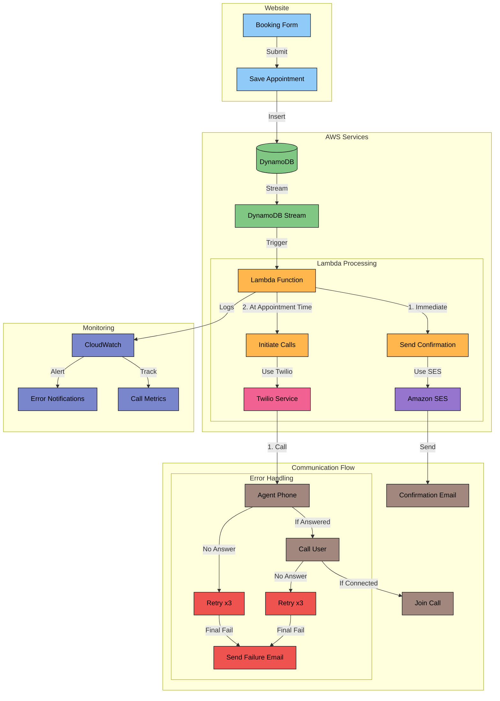

# AWS-APPOINTMENT-SYSTEM

## Overview
This system handles appointment scheduling and notifications using AWS services including DynamoDB, Lambda, SES, and SNS, with Twilio integration for voice calls.

## Architecture - Tomorrow's AI Appointment System - Detailed Flow



## Prerequisites
- AWS Account with appropriate permissions
- Twilio Account (for voice calls)
- Appointment saved in DynamoDB
- Verified email in SES
- Python 3.9

## Versions
- Last Updated: December 7, 2024
- AWS SDK Version:  1.26.137
- Python Version: 3.9

## Table of Contents
1. DynamoDB Setup
2. Enable DynamoDB Stream
3. Create Lambda Function
4. Set Up IAM Role
5. Attach Role to Lambda Function
6. Set Up Email (SES)
7. Lambda Function Setup
8. Testing Email Notifications
9. Update Lambda for Enhanced Email Templates
10. Setting Up the Twilio Integration Environment
11. Prepare for Twilio Integration
12. Twilio Implementation (When Credentials Received)
13. Testing Full Implementation
14. Maintenance and Monitoring
...

# APPOINTMENT SYSTEM DOCUMENTATION

## 1. DynamoDB Setup
[Add existing documentation here]

## 2. Enable DynamoDB Stream

Open the AWS Console and search for DynamoDB.

Choose your Appointments table from the list of tables.

Click "Exports and streams"

Under "DynamoDB stream details", click "Turn On"


Choose "New and old images" for stream view type


Save changes


## 3. Create Lambda Function

Search for Lambda in the AWS Console.

Click Create function

Choose Author from scratch


##### Add Basic Information:

Function name: Choose descriptive name

Runtime: Python 3.9

Architecture: x86_64

Click Create function

## 4. Set Up IAM Role

Search for IAM in the AWS console.

Click on Roles and Create Role

Choose AWS Service Lambd and then Next

Search for these policies and check them
- AWSLambdaBasicExecutionRole (allows logging to CloudWatch)
- AWSLambdaBasicExecutionRole (allows access to DynamoDB)

Click Add

Name Role (e.g., LambdaDynamoDBRole)


Create Role

## 5. Attach Role to Lambda Function

Go to Lambda console

Select Lambda function (e.g., AppointmentNotificationHandler)

Click Permissions

In the configuration tabe, find Execution Role and click edit

Select role just created (e.g., LambdaDynamoDBRole)

Save


## 6. Set Up Email (SES)

Search for Amazon SES in the AWS Management Console and open it.

Click Verified identities

Click Create identity

Choose "Email address" (or domain)

Enter your email (or domain)

Click verification link in your email

You Will Need to Add this Verified Email to Your Lambda Function Later.

## 7. Lambda Function Setup 

### A. Basic Lambda Configuration
Go to Lambda function
Click "Configuration" tab
Under "General configuration":
Memory: 128 MB
Timeout: 3 min
Click "Edit" to modify if needed

### B. Add DynamoDB Trigger
Click "Add trigger"
Select "DynamoDB"
Configure trigger:
Choose your DynamoDB table which should add your stream ARN
Starting position: Latest
Enable trigger: Checked
Click Add

### C. Add IAM Permissions
Go to Configuration → Permissions
Click the role name (takes you to IAM)
Add these policies:
- AmazonSESFullAccess (for sending emails)
- AmazonSNSFullAccess (for sending SMS)
- AmazonEventBridgeFullAccess (for new appointments and reminders)

### D. Initial Code Setup (Email Only)
In the Code tab, paste this basic version:

```python
import boto3
import json

ses_client = boto3.client('ses')

def send_email(to_email, subject, body):
    try:
        response = ses_client.send_email(
            Source='your-verified-email@example.com',  # Your verified SES email
            Destination={'ToAddresses': [to_email]},
            Message={
                'Subject': {'Data': subject},
                'Body': {'Text': {'Data': body}},
            }
        )
        print(f"Email sent! Message ID: {response['MessageId']}")
    except Exception as e:
        print(f"Error sending email: {str(e)}")

def lambda_handler(event, context):
    print("Event Received: ", json.dumps(event))

    for record in event['Records']:
        if record['eventName'] == 'INSERT':
            new_image = record['dynamodb']['NewImage']
            
            # Extract appointment details
            time = new_image['time']['S']
            user_email = new_image['email']['S']
            name = new_image['name']['S']
            
            # Send confirmation email
            subject = "Appointment Confirmation"
            body = f"Hello {name},\n\nYour appointment is scheduled for {time}.\n\nBest regards,\nTomorrow's AI Team"
            
            send_email(user_email, subject, body)

    return {"statusCode": 200, "body": "Lambda executed successfully"}
```

### E. Configuring Lambda Environment Variables

Go to the Lambda console and go back to the Appointment Notification Handler

Add the following environment variables
- In the send_email() section add your verified email (e.g., source="verifiedEmail@yahoo.com")
- In the eventbridge_client.put_targets() section, add your Lambda ARN which can be found in top right of page (Targets=[{'Id': '1', 'Arn': 'arn:aws:lambda:us-east-1:123456789012:function:YourFunctionName'}])

## 8. Testing Email Notifications

### A. Test Setup

Create test appointment through your booking system

Check DynamoDB to confirm data is saved

Check CloudWatch logs:

Go to Lambda → Monitor → Logs

Click View logs in CloudWatch above code

Scroll to bottom and look for most recent log stream

### B. What to Check

In CloudWatch logs:
- Verify "Event Received" message
- Check for any error messages
- Confirm "Email sent!" message
- 
In your email:
- Check for confirmation email
Verify all information is correct

### C. Troubleshooting
If emails aren't received:
-Check SES email verification
-Verify Lambda execution role permissions
-Check CloudWatch logs for specific errors

## 9. Update Lambda for Enhanced Email Templates

### A. Update Lambda Code with HTML Templates
In Lambda, replace the basic email code with HTML version:

```python
def send_email(to_email, subject, body_html):
    try:
        response = ses_client.send_email(
            Source='your-verified-email@example.com',
            Destination={'ToAddresses': [to_email]},
            Message={
                'Subject': {'Data': subject},
                'Body': {
                    'Html': {'Data': body_html},
                    'Text': {'Data': body_html.replace('<br>', '\n')}
                }
            }
        )
        print(f"Email sent! Message ID: {response['MessageId']}")
    except Exception as e:
        print(f"Error sending email: {str(e)}")
```
        
Add HTML templates (as shown in previous code)

Click "Deploy"

Test with new appointment booking

## 10. Setting Up the Twilio Integration Environment

## #A. Create Required Folders
BASH

mkdir twilio-layer
cd twilio-layer
mkdir python
pip install twilio -t python
Zip the python folder

### B. Create Lambda Layer
Go to Lambda → Layers
Click "Create layer"
Name: twilio-layer
Upload zip file
Choose Python 3.9
Click "Create"

### C. Add Layer to Function
Go to your Lambda function
Click "Layers"
Click "Add a layer"
Choose "Custom layers"
Select twilio-layer
Click "Add"

### D. Add Environment Variables (Placeholder)
Go to Configuration → Environment variables
Click "Edit"
Add variables (leave values blank for now):

TWILIO_ACCOUNT_SID
TWILIO_AUTH_TOKEN
TWILIO_PHONE_NUMBER
AGENT_PHONE
AGENT_EMAIL
Click "Save"

## 11. Prepare for Twilio Integration

### A. Test Appointment Creation
Create new appointment through booking system
Check DynamoDB for new entry
Verify HTML email received
Check CloudWatch logs

### B. Verify Environment
Check Lambda configuration:
Memory and timeout settings
IAM roles and permissions
Environment variables
Layer attachment

### C. Document Any Issues
Keep track of:

Any error messages
Email delivery times
System behavior

## 12. Twilio Implementation (When Credentials Received)
### A. Update Environment Variables
Go to Lambda → Configuration → Environment variables
Click "Edit"
Add Twilio credentials:

TWILIO_ACCOUNT_SID = [from boss]
TWILIO_AUTH_TOKEN = [from boss]
TWILIO_PHONE_NUMBER = [from boss]
AGENT_PHONE = [consultant's number]
AGENT_EMAIL = [consultant's email]

### B. Create TwiML Bins in Twilio
Log into Twilio console
Go to Runtime → TwiML Bins
Create Agent Greeting:
XML

<Response>
    <Say>Hello consultant. You have a scheduled appointment with {client_name}. 
    They will be connected shortly. Please stay on the line.</Say>
    <Play>[your-hold-music-url]</Play>
</Response>
Create User Greeting:
XML

<Response>
    <Say>Hello {client_name}, thank you for choosing Tomorrow's AI. 
    Your consultant is ready to speak with you.</Say>
</Response>
Save both and copy URLs

### C. Update Lambda Function
Add TwiML URLs to environment variables:
TWIML_URL_AGENT = [URL from step B3]
TWIML_URL_USER = [URL from step B4]
Update Lambda code with full implementation (the complete code we developed)

## 13. Testing Full Implementation

### 1. Test Email Only First
Create test appointment
Verify email received
Check CloudWatch logs

### 2. Test Call Flow (Agent)
Create test appointment
Verify agent receives call
Test all three scenarios:
Agent answers
Agent doesn't answer
Agent disconnects

### 3. Test Call Flow (User)
Test when agent answers:
User answers
User doesn't answer
User disconnects

### 4. Monitor in CloudWatch
Check logs for:


- "Starting appointment calls for [name]"
- "Agent call status: [status]"
- "User call status: [status]"
- Any error messages
- 
## E. Common Issues and Solutions

### 1. Call Not Initiating
Check:

Twilio credentials
Phone number format
Lambda timeout settings
CloudWatch logs for errors

### 2. Call Connected but No Audio
Check:
-TwiML URLs
-TwiML syntax
-Twilio phone number permissions

### 3. Email Issues
Check:
-SES verification
-Email format
-Spam folders

## 14. Maintenance and Monitoring

### A. Regular Checks
Monitor CloudWatch logs daily
Check failed connection patterns
Verify email deliverability
Test call quality

### B. Updates Needed
Update TwiML messages
Modify email templates
Adjust retry attempts/timing
Update phone numbers
